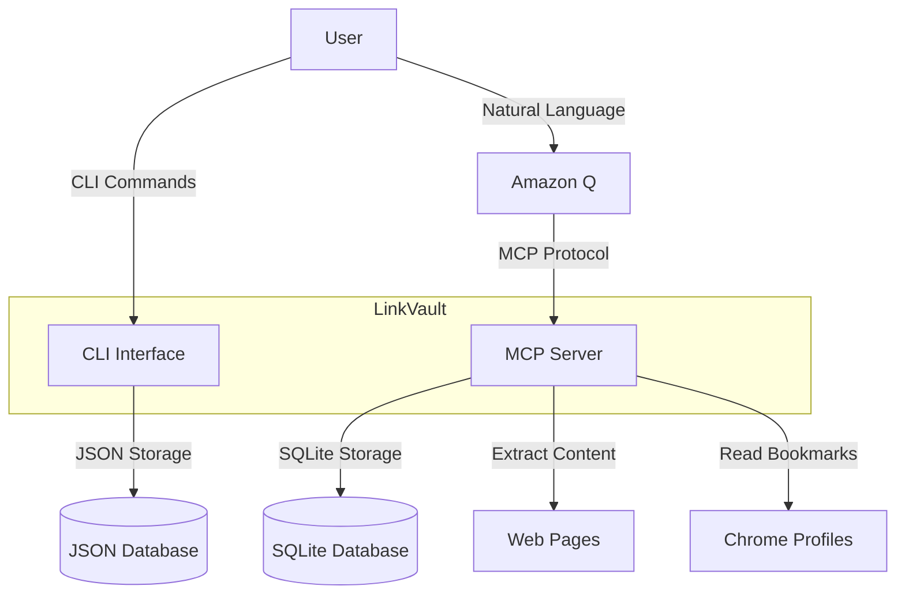
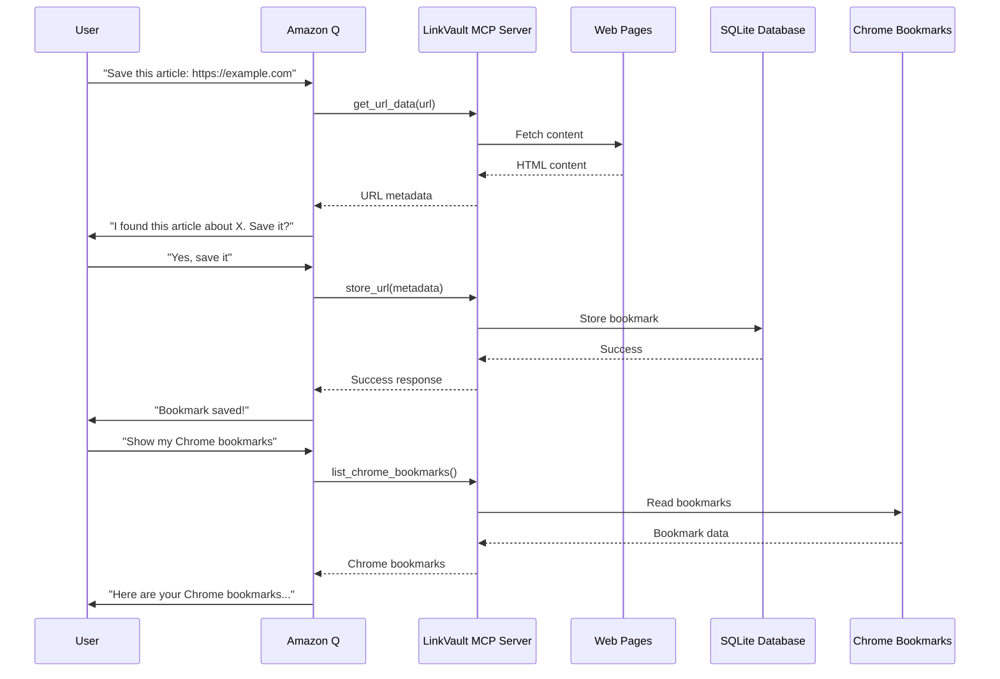
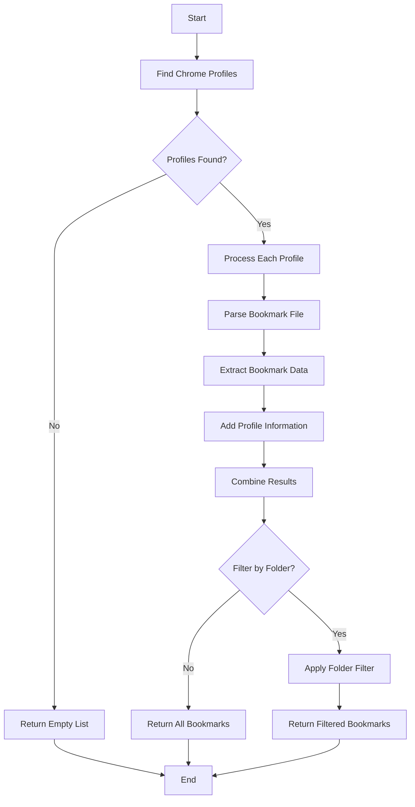

# LinkVault MCP Server

A tool for managing, categorizing, and searching web URLs with both CLI and AI-assisted interfaces.

## Features

- **CLI Interface**: Simple command-line tool for managing bookmarks
- **MCP Server**: Model Context Protocol server for AI-assisted bookmark management
- **Content Extraction**: Automatically extract webpage titles and content
- **Intelligent Categorization**: AI-assisted categorization and tagging (with MCP)
- **Local Storage**: Store bookmarks in SQLite database or JSON file
- **Browser Integration**: Import and manage Chrome bookmarks across all profiles

## Installation

1. Make sure you have Python 3.10+ installed
2. Install required packages:
   ```
   pip install -r requirements.txt
   ```
3. Make the scripts executable:
   ```
   chmod +x main.py src/url_manager.py src/server.py
   ```

## Architecture

### System Overview



### MCP Workflow



### Browser Integration



## Project Structure

```
linkvault-mcp-server/
├── src/                    # Source code directory
│   ├── __init__.py         # Package initialization
│   ├── server.py           # MCP server implementation
│   ├── url_manager.py      # CLI implementation
│   └── utils/              # Utility functions
│       ├── __init__.py
│       └── browser_integration.py  # Browser integration utilities
├── data/                   # Database storage
├── main.py                 # Main entry point
├── README.md               # This file
├── CHANGELOG.md            # Version history
└── pyproject.toml          # Project dependencies
```

## Usage

### CLI Mode

The CLI mode uses a simple JSON file for storage and provides basic bookmark management.

```
./main.py --mode cli
```

Or directly:

```
./src/url_manager.py <command> [options]
```

#### CLI Commands

- **Add a URL**: `add <url> <category> [-t tags] [-n notes] [--title custom_title]`
- **List Categories**: `categories`
- **List URLs in Category**: `list <category>`
- **Search URLs**: `search <query>`
- **List Tags**: `tags`
- **List URLs with Tag**: `tag <tag>`
- **Delete URL**: `delete <url> [-c category]`
- **Rename Category**: `rename <old_name> <new_name>`
- **Delete Category**: `delcat <category>`
- **List Chrome Bookmarks**: `chrome [-f folder]`
- **Import Chrome Bookmark**: `import <url> <category> [-t tags] [--title title]`

### MCP Server Mode

The MCP server mode provides AI-assisted bookmark management when used with Amazon Q.

```
./main.py --mode mcp
```

Or directly:

```
./src/server.py
```

#### Amazon Q MCP Setup

To use the bookmark manager with Amazon Q, you need to update the Amazon Q MCP configuration:

1. Edit the MCP configuration file:
   ```
   nano ~/.aws/amazonq/mcp.json
   ```

2. Add the bookmark_manager configuration:
   ```json
   "bookmark_manager": {
     "command": "uv",
     "args": ["--directory", "/path/to/linkvault-mcp-server", "run", "src/server.py"],
     "env": {},
     "disabled": false,
     "autoApprove": ["get_url_data", "store_url", "search_bookmarks", "list_categories", "list_bookmarks_by_category", "delete_bookmark", "list_chrome_bookmarks", "import_chrome_bookmark"]
   }
   ```

3. Replace `/path/to/linkvault-mcp-server` with the actual path to your installation directory.

4. Save the file and restart Amazon Q CLI if it's already running.

#### MCP Tools

- **get_url_data**: Extract data from a URL
- **store_url**: Store a URL with metadata
- **search_bookmarks**: Search for bookmarks
- **list_categories**: List all categories
- **list_bookmarks_by_category**: List bookmarks in a category
- **delete_bookmark**: Delete a bookmark by URL
- **list_chrome_bookmarks**: List Chrome bookmarks across all profiles
- **import_chrome_bookmark**: Import a Chrome bookmark into the database

### Example Interactions with Amazon Q

```
You: "Save this article: https://example.com/article"

Amazon Q: "I'll analyze that article for you. One moment..."
[Amazon Q calls get_url_data() behind the scenes]

Amazon Q: "I've analyzed the article and it appears to be about machine learning. 
Would you like me to save it with the following details?
- Category: Machine Learning
- Tags: AI, neural networks, deep learning
- Description: An overview of recent advances in neural network architectures
- Importance: 4 (seems quite relevant)"

You: "Yes, that looks good"

Amazon Q: "Great! I've saved the article to your bookmarks."
[Amazon Q calls store_url() behind the scenes]

You: "Show me my Chrome bookmarks"

Amazon Q: "Here are your Chrome bookmarks:"
[Amazon Q calls list_chrome_bookmarks() behind the scenes and displays results]

You: "Import the third bookmark into my Research category"

Amazon Q: "I've imported the bookmark into your Research category."
[Amazon Q calls import_chrome_bookmark() behind the scenes]
```

## Data Storage

- CLI mode: JSON file at `~/Documents/github/linkvault-mcp-server/data/url_database.json`
- MCP mode: SQLite database at `~/Documents/github/linkvault-mcp-server/data/bookmarks.db`

## Browser Integration

LinkVault supports integration with web browsers to import and manage bookmarks:

### Chrome Integration

- Lists bookmarks from all Chrome profiles on your system
- Preserves folder structure from Chrome
- Supports filtering by folder path
- Works on macOS, Windows, and Linux
- Handles multiple profiles and combines results

## MCP Tool Reference

### get_url_data

```python
def get_url_data(url: str) -> Dict[str, Any]:
    """
    Fetch and extract data from a URL.
    
    Args:
        url: The URL to fetch and analyze
        
    Returns:
        A dictionary containing extracted data from the URL
    """
```

### store_url

```python
def store_url(url: str, title: str, category: str, 
              tags: List[str], description: str, 
              importance: int, notes: str = None) -> Dict[str, Any]:
    """
    Store a URL with AI-generated metadata.
    
    Args:
        url: The URL to store
        title: The title of the webpage
        category: The category to assign
        tags: List of tags to associate with the URL
        description: A brief description of the content
        importance: Importance rating (1-5)
        notes: Optional additional notes or comments about the URL
        
    Returns:
        A dictionary indicating success or failure
    """
```

### search_bookmarks

```python
def search_bookmarks(query: str) -> Dict[str, Any]:
    """
    Search for bookmarks by query.
    
    Args:
        query: The search query
        
    Returns:
        A dictionary containing search results
    """
```

### list_categories

```python
def list_categories() -> Dict[str, Any]:
    """
    List all bookmark categories.
    
    Returns:
        A dictionary containing all categories and their counts
    """
```

### list_bookmarks_by_category

```python
def list_bookmarks_by_category(category: str) -> Dict[str, Any]:
    """
    List all bookmarks in a specific category.
    
    Args:
        category: The category name
        
    Returns:
        A dictionary containing bookmarks in the specified category
    """
```

### delete_bookmark

```python
def delete_bookmark(url: str, category: str = None) -> Dict[str, Any]:
    """
    Delete a bookmark from the database.
    
    Args:
        url: The URL of the bookmark to delete
        category: Optional category to specify which bookmark to delete if the same URL exists in multiple categories
        
    Returns:
        A dictionary indicating success or failure and details about the deleted bookmark
    """
```

### list_chrome_bookmarks

```python
def list_chrome_bookmarks(folder: str = None) -> Dict[str, Any]:
    """
    List Chrome bookmarks, optionally filtered by folder.
    
    Args:
        folder: Optional folder path to filter bookmarks
        
    Returns:
        A dictionary containing Chrome bookmarks
    """
```

### import_chrome_bookmark

```python
def import_chrome_bookmark(url: str, title: str, category: str, 
                          tags: List[str], description: str = "", 
                          importance: int = 3, notes: str = None) -> Dict[str, Any]:
    """
    Import a Chrome bookmark into the database.
    
    Args:
        url: The URL of the Chrome bookmark to import
        title: The title of the bookmark
        category: The category to assign
        tags: List of tags to associate with the URL
        description: A brief description of the content
        importance: Importance rating (1-5)
        notes: Optional additional notes or comments about the URL
        
    Returns:
        A dictionary indicating success or failure
    """
```

## Development

### Requirements

- Python 3.10+
- Dependencies in pyproject.toml:
  - beautifulsoup4
  - fastapi
  - fastmcp
  - mcp
  - requests

## License

MIT License
