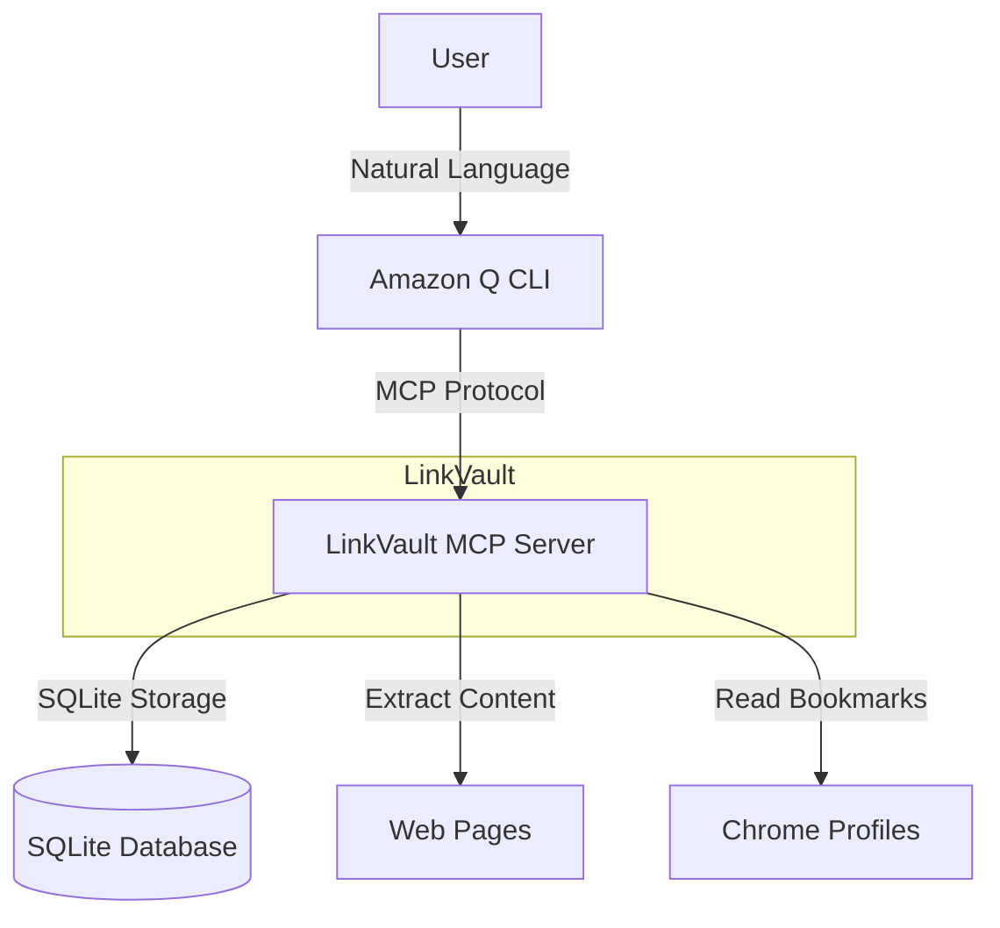
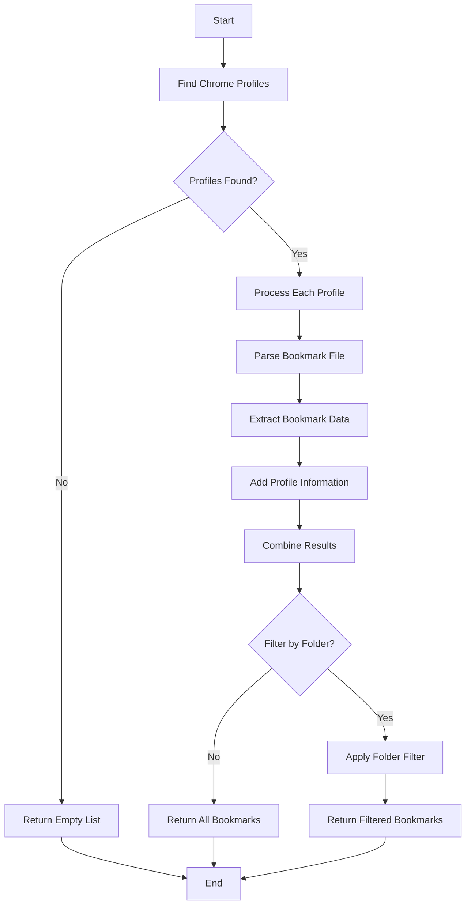

# LinkVault MCP Server

A tool for extending Amazon Q CLI with AI-assisted bookmark management capabilities.

## Overview

LinkVault is an MCP (Model Context Protocol) server that integrates with Amazon Q CLI to provide intelligent bookmark management through natural language. It allows you to access, organize, and search your bookmarks using conversational commands in your terminal.

## Key Features

- **Amazon Q CLI Integration**: Manage bookmarks using natural language in your terminal
- **Chrome Multi-Profile Support**: Access bookmarks from all your Chrome profiles
- **Content Extraction**: Automatically analyze webpage content for better categorization
- **Intelligent Organization**: AI-assisted categorization and tagging
- **Cross-Platform**: Works on macOS, Windows, and Linux

## Installation

1. Make sure you have Python 3.10+ installed
2. Install required packages:
   ```
   pip install -r requirements.txt
   ```
3. Make the scripts executable:
   ```
   chmod +x main.py src/url_manager.py src/server.py
   ```

## Amazon Q CLI Setup

To use LinkVault with Amazon Q CLI, you need to register it as an MCP server:

1. Edit the MCP configuration file:
   ```
   nano ~/.aws/amazonq/mcp.json
   ```

2. Add the bookmark_manager configuration:
   ```json
   "bookmark_manager": {
     "command": "uv",
     "args": ["--directory", "/path/to/linkvault-mcp-server", "run", "src/server.py"],
     "env": {},
     "disabled": false,
     "autoApprove": ["get_url_data", "store_url", "search_bookmarks", "list_categories", "list_bookmarks_by_category", "delete_bookmark", "list_chrome_bookmarks", "import_chrome_bookmark"]
   }
   ```

3. Replace `/path/to/linkvault-mcp-server` with the actual path to your installation directory.

4. Save the file and restart Amazon Q CLI if it's already running.

## MCP Architecture

LinkVault uses the Model Context Protocol to extend Amazon Q CLI with bookmark management capabilities:



## MCP Workflow


## Browser Integration

LinkVault can access bookmarks from all Chrome profiles on your system:



## Example Interactions with Amazon Q CLI

```
$ q chat
Welcome to Amazon Q CLI!

> Save this article: https://docs.aws.amazon.com/lambda/latest/dg/lambda-urls.html

I'll analyze that article for you. One moment...

I've analyzed the article and it appears to be about AWS Lambda Function URLs.
Would you like me to save it with the following details?
- Category: Serverless
- Tags: lambda, api, function-urls, http-endpoints
- Description: Documentation on how to create and configure function URLs to provide dedicated HTTP(S) endpoints for Lambda functions.
- Importance: 4 (High)

> Yes, that looks good

Great! I've saved the article to your bookmarks.

> Show me my Chrome bookmarks about AWS

I'll check your Chrome bookmarks for AWS-related content.

Found 12 bookmarks related to AWS across your Chrome profiles:
1. AWS Management Console
   URL: https://console.aws.amazon.com/
   Profile: Work/Bookmarks Bar

2. Amazon EC2 Documentation
   URL: https://docs.aws.amazon.com/ec2/
   Profile: Work/AWS Documentation

[...more results...]

Would you like me to import any of these into your LinkVault collection?

> Import the first one into my AWS category

I've imported "AWS Management Console" into your AWS category with tags: aws, console, management.
```

## MCP Tool Reference

### get_url_data

```python
def get_url_data(url: str) -> Dict[str, Any]:
    """
    Fetch and extract data from a URL.
    
    Args:
        url: The URL to fetch and analyze
        
    Returns:
        A dictionary containing extracted data from the URL
    """
```

### store_url

```python
def store_url(url: str, title: str, category: str, 
              tags: List[str], description: str, 
              importance: int, notes: str = None) -> Dict[str, Any]:
    """
    Store a URL with AI-generated metadata.
    
    Args:
        url: The URL to store
        title: The title of the webpage
        category: The category to assign
        tags: List of tags to associate with the URL
        description: A brief description of the content
        importance: Importance rating (1-5)
        notes: Optional additional notes or comments about the URL
        
    Returns:
        A dictionary indicating success or failure
    """
```

### search_bookmarks

```python
def search_bookmarks(query: str) -> Dict[str, Any]:
    """
    Search for bookmarks by query.
    
    Args:
        query: The search query
        
    Returns:
        A dictionary containing search results
    """
```

### list_categories

```python
def list_categories() -> Dict[str, Any]:
    """
    List all bookmark categories.
    
    Returns:
        A dictionary containing all categories and their counts
    """
```

### list_bookmarks_by_category

```python
def list_bookmarks_by_category(category: str) -> Dict[str, Any]:
    """
    List all bookmarks in a specific category.
    
    Args:
        category: The category name
        
    Returns:
        A dictionary containing bookmarks in the specified category
    """
```

### delete_bookmark

```python
def delete_bookmark(url: str, category: str = None) -> Dict[str, Any]:
    """
    Delete a bookmark from the database.
    
    Args:
        url: The URL of the bookmark to delete
        category: Optional category to specify which bookmark to delete if the same URL exists in multiple categories
        
    Returns:
        A dictionary indicating success or failure and details about the deleted bookmark
    """
```

### list_chrome_bookmarks

```python
def list_chrome_bookmarks(folder: str = None) -> Dict[str, Any]:
    """
    List Chrome bookmarks, optionally filtered by folder.
    
    Args:
        folder: Optional folder path to filter bookmarks
        
    Returns:
        A dictionary containing Chrome bookmarks
    """
```

### import_chrome_bookmark

```python
def import_chrome_bookmark(url: str, title: str, category: str, 
                          tags: List[str], description: str = "", 
                          importance: int = 3, notes: str = None) -> Dict[str, Any]:
    """
    Import a Chrome bookmark into the database.
    
    Args:
        url: The URL of the Chrome bookmark to import
        title: The title of the bookmark
        category: The category to assign
        tags: List of tags to associate with the URL
        description: A brief description of the content
        importance: Importance rating (1-5)
        notes: Optional additional notes or comments about the URL
        
    Returns:
        A dictionary indicating success or failure
    """
```

## Data Storage

LinkVault stores bookmarks in an SQLite database at `~/Documents/github/linkvault-mcp-server/data/bookmarks.db`

## Development

### Requirements

- Python 3.10+
- Dependencies in pyproject.toml:
  - beautifulsoup4
  - fastapi
  - fastmcp
  - mcp
  - requests

## Project Structure

```
linkvault-mcp-server/
├── src/                    # Source code directory
│   ├── __init__.py         # Package initialization
│   ├── server.py           # MCP server implementation
│   ├── url_manager.py      # CLI implementation
│   └── utils/              # Utility functions
│       ├── __init__.py
│       └── browser_integration.py  # Browser integration utilities
├── data/                   # Database storage
├── main.py                 # Main entry point
├── README.md               # This file
├── CHANGELOG.md            # Version history
└── pyproject.toml          # Project dependencies
```

## Additional Features

### CLI Mode

In addition to the MCP integration with Amazon Q CLI, LinkVault also provides a standalone CLI interface for direct bookmark management.

```
./main.py --mode cli
```

Or directly:

```
./src/url_manager.py <command> [options]
```

#### CLI Commands

- **Add a URL**: `add <url> <category> [-t tags] [-n notes] [--title custom_title]`
- **List Categories**: `categories`
- **List URLs in Category**: `list <category>`
- **Search URLs**: `search <query>`
- **List Tags**: `tags`
- **List URLs with Tag**: `tag <tag>`
- **Delete URL**: `delete <url> [-c category]`
- **Rename Category**: `rename <old_name> <new_name>`
- **Delete Category**: `delcat <category>`
- **List Chrome Bookmarks**: `chrome [-f folder]`
- **Import Chrome Bookmark**: `import <url> <category> [-t tags] [--title title]`

### CLI Data Storage

The CLI mode uses a JSON file for storage at `~/Documents/github/linkvault-mcp-server/data/url_database.json`

## License

MIT License
